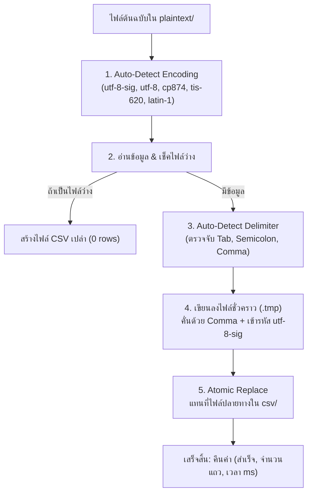

# รายละเอียด Logic การแปลงไฟล์เป็น CSV (Auto CSV Conversion Logic)

เอกสารนี้อธิบายลำดับขั้นตอนการทำงาน (Logic Pipeline) ของระบบ **Auto CSV Converter** (`core/converter_service.py`) ซึ่งทำหน้าที่แปลงไฟล์ที่ดาวน์โหลดมาจาก PLC (ทั้งไฟล์ `.txt` และ `.csv` ต้นฉบับ) ให้กลายเป็นไฟล์ CSV มาตรฐานสากลที่เปิดใช้งานได้ทันที

---

## 1. ที่มาและความจำเป็น (Why Conversion is Needed)

ไฟล์ Log ที่ส่งออกมาจาก PLC (เช่น Keyence, Omron, Mitsubishi) มักมีปัญหาเมื่อนำมาเปิดใช้งานบนเครื่องคอมพิวเตอร์:
1. **ตัวคั่นข้อมูลไม่ใช่ Comma**: ส่วนใหญ่ใช้ **Tab (`\t`)** หรือ **Semicolon (`;`)** ทำให้เวลาเปิดด้วย Microsoft Excel ข้อมูลทั้งหมดจะไปกองรวมกันอยู่ใน Column แรก (คอลัมน์ A) ช่องเดียว
2. **ภาษาไทยเพี้ยนเป็นภาษาต่างดาว**: PLC มักบันทึกด้วยรหัสภาษาไทยแบบเก่า (เช่น `CP874` หรือ `TIS-620`) หากเปิดตรงๆ ในโปรแกรมรุ่นใหม่ สระและวรรณยุกต์ภาษาไทยจะอ่านไม่รู้เรื่อง
3. **ขาด BOM Header**: ไฟล์ UTF-8 ทั่วไปเมื่อเปิดใน Excel บน Windows มักแสดงผลฟอนต์เพี้ยน เพราะ Excel ต้องการ `BOM (Byte Order Mark)` ในการระบุตัวอักษร

> **ระบบ Auto CSV Converter จึงถูกออกแบบมาเพื่อแก้ไขปัญหาเหล่านี้ให้โดยอัตโนมัติ 100% ทันทีที่ไฟล์ถูกดาวน์โหลดเสร็จ**

---

## 2. โครงสร้างโฟลเดอร์ต้นทางและปลายทาง (Source & Destination)

ไฟล์จะถูกแยกเก็บเป็น 2 รูปแบบเสมอ:

```text
(01-09-2026 - 07-09-2026)/
├── plaintext/      <-- ไฟล์ต้นฉบับ 100% ที่ดึงมาจาก PLC (.txt หรือ .csv)
└── csv/            <-- ไฟล์ผลลัพธ์ที่ผ่านการแปลงจัดคอลัมน์และแก้ภาษาไทยแล้ว (.csv)
```

* **ชื่อไฟล์ต้นทาง**: เช่น `020425.txt` หรือ `020425.csv`
* **ชื่อไฟล์ปลายทาง**: จะเป็นนามสกุล `.csv` เสมอ เช่น `020425.csv`

---

## 3. ขั้นตอนการแปลงไฟล์ทีละขั้น (Step-by-Step Conversion Pipeline)



---

### ขั้นที่ 1: ตรวจสอบและถอดรหัสภาษาอัตโนมัติ (Encoding Detection)
ระบบจะวนลูปทดสอบอ่านไฟล์ด้วย Encoding ที่พบบ่อยในเครื่องจักรโรงงานและระบบไทย:
```python
ENCODINGS_TO_TRY = ["utf-8-sig", "utf-8", "cp874", "tis-620", "latin-1"]
```
* หากอ่านด้วย `utf-8-sig` ไม่สำเร็จ จะลอง `utf-8`
* หากยังติดปัญหาตัวอักษร จะลองรหัสภาษาไทยของ Windows (`cp874`) และภาษาไทยมาตรฐาน (`tis-620`)
* หากไฟล์มีอักขระพิเศษอื่นๆ จะใช้ `latin-1` เป็น Fallback สุดท้าย ป้องกันไม่ให้โปรแกรมแครช

---

### ขั้นที่ 2: ตรวจจับตัวคั่นข้อมูลอัตโนมัติ (Delimiter Auto-Detection)
ระบบจะอ่านบรรทัด Header แรกที่มีข้อมูล และตรวจสอบว่าใช้ตัวคั่นประเภทใด:
```python
def detect_delimiter(first_line: str) -> str:
    if "\t" in first_line:
        return "\t"  # Tab-separated (พบบ่อยที่สุดใน PLC Keyence)
    if ";" in first_line and "," not in first_line:
        return ";"   # Semicolon-separated (พบบ่อยในเครื่องจักรยุโรป)
    if "," in first_line:
        return ","   # Comma-separated (มาตรฐาน CSV ทั่วไป)
    return "\t"      # ค่าเริ่มต้นเป็น Tab
```

---

### ขั้นที่ 3: จัดระเบียบคอลัมน์และเขียนไฟล์มาตรฐาน (CSV Formatting)
* ใช้โมดูลมาตรฐาน `csv.reader` โดยกำหนดตัวคั่นตามที่ตรวจพบในขั้นที่ 2
* เขียนข้อมูลออกใหม่ด้วย `csv.writer` โดยบังคับใช้:
  * **Delimiter**: ใช้เครื่องหมายจุลภาค (`,` Comma) เท่านั้น
  * **Quoting**: ใช้ `csv.QUOTE_MINIMAL` ใส่เครื่องหมายคำพูดคลุมเฉพาะข้อความที่มีเครื่องหมายคอมม่าด้านใน เพื่อไม่ให้คอลัมน์แตก
  * **Encoding**: เข้ารหัสเป็น **`utf-8-sig` (UTF-8 with BOM)**

---

### ขั้นที่ 4: ความปลอดภัยในการเขียนไฟล์ (Atomic Safe Write)
* ระบบจะเขียนข้อมูลลงในไฟล์ชั่วคราวที่มีนามสกุล **`.tmp`** ก่อนเสมอ (เช่น `020425.tmp`)
* เมื่อเขียนครบทุกบรรทัดและปิดไฟล์อย่างสมบูรณ์แล้ว จึงทำการ **Rename/Replace** ทับไฟล์จริง (`020425.csv`)
* **ประโยชน์**: ป้องกันไม่ให้เกิดไฟล์เสีย (Corrupted File) ในกรณีที่ไฟดับ หรือโปรแกรมถูกปิดระหว่างที่กำลังเขียนไฟล์

---

## 4. ผลลัพธ์และสถิติการแปลง (Output & Logging)

ระบบจะจับเวลาการแปลงไฟล์ในระดับมิลลิวินาที (`ms`) และนับจำนวนแถวข้อมูล (`row_count`) รายงานลงใน Log Console แบบ Real-time:

```text
[10:15:20.312] [LINE 1][MC1] Downloaded 020425.txt (42.5 KB) in 152.3 ms
[10:15:20.335] [LINE 1][MC1] Converted to csv/020425.csv (1,250 rows) in 23.1 ms
```

---

## 5. การเปิดใช้งานไฟล์ CSV ที่แปลงแล้ว

| โปรแกรมที่ใช้เปิด | ผลการแสดงผล |
|---|---|
| **Microsoft Excel (ดับเบิ้ลคลิกเปิดตรงๆ)** | ✅ **ข้อมูลแยกคอลัมน์สวยงาม ภาษาไทยไม่เพี้ยน ไม่เป็นภาษาต่างดาว** |
| **Notepad / Text Editor** | ✅ แสดงผลภาษาไทยและอักขระพิเศษได้อย่างถูกต้อง 100% |
| **Terminal / CLI (`cat`, `type`)** | ✅ อ่านข้อมูลแยกคั่นด้วยเครื่องหมายจุลภาค (`,`) ได้ตามมาตรฐาน |
| **Data Tools (Python Pandas, SQL, BI)** | ✅ นำเข้าได้ทันทีโดยไม่ต้องระบุ Delimiter พิเศษ เพราะเป็น Comma มาตรฐาน |
