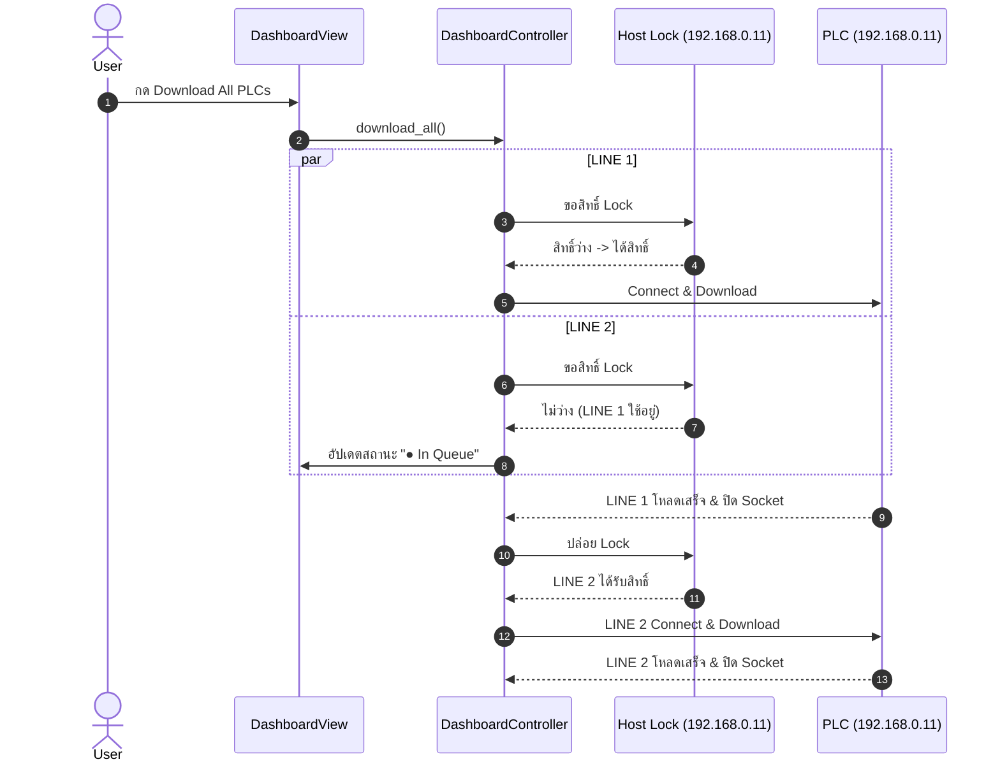

# Design Spec: Duplicate IP Prevention & Per-Host Connection Queue

## 1. Overview & Objectives
- **Branch:** `main` (or dedicated feature branch)
- **Objective:** ป้องกันการชนกันของ Connection ไปยังตู้ PLC เมื่อมีหลาย Line (Connection Collision Prevention) ทั้งในระดับฟอร์มกรอกข้อมูลและในระดับการรันดาวน์โหลดเบื้องหลัง
- **Requirements:**
  1. **Strict Form Validation:** ห้ามบันทึก Line ที่มี IP Address (และ Port) ซ้ำกับ Line อื่นในระบบ เพื่อตัดปัญหาตั้งแต่ต้นลม พร้อมทั้งห้ามชื่อ Line ซ้ำ
  2. **Per-Host Download Queue (Safety Net):** กรณีที่ config มี IP ซ้ำ (เช่น แก้ไขไฟล์ `config.json` ด้วยตนเอง) ตัวคุมการดาวน์โหลด (`DashboardController`) จะจัดคิวด้วย `threading.Lock` ราย Host/IP เพื่อให้ทำงานทีละ Line ต่อ 1 ตู้ PLC ป้องกัน Socket ล่ม 100% ส่วน Line ที่คนละ IP จะยังคงดาวน์โหลดพร้อมกันแบบ Parallel เต็มความเร็ว

---

## 2. Architectural Design

### 2.1 UI / Form Validation Level (`PLCManagerController` & `PLCModalDialog`)
- **Method:** `PLCManagerController.validate_plc(data, edit_index=None)`
- **Rules:**
  - ตรวจสอบชื่อ Line (`name`): ต้องไม่ซ้ำกับ Line อื่นใน `config_manager.get()["plcs"]` (ยกเว้นตู้เดิมที่กำลังแก้ไขตาม `edit_index`)
  - ตรวจสอบ `host` และ `port`: ต้องไม่ซ้ำกับคู่ `(host, port)` ของ Line อื่น
  - หากพบว่าซ้ำ:
    - ส่งกลับ `(False, "❌ IP Address '192.168.0.11' ถูกใช้งานแล้วโดย 'LINE 1' (ไม่อนุญาตให้ใช้ IP ซ้ำกันเพื่อป้องกัน Connection ชนกัน)", None)`
  - `PLCModalDialog` จะแสดงข้อความแจ้งเตือนสีแดงใน `test_status_lbl` และไม่อนุญาตให้ปิดหน้าต่างหรือบันทึกข้อมูล

### 2.2 Runtime Concurrency Level (`DashboardController`)
- **Host Lock Registry:**
  - `self._host_locks: Dict[str, threading.Lock] = {}`
  - `self._host_locks_mutex = threading.Lock()`
  - ฟังก์ชัน `get_host_lock(host: str) -> threading.Lock`
- **Queueing Behavior:**
  - เมื่อ `download_single` ถูกเรียก:
    - ดึง lock ของ host นั้น: `host_lock = self.get_host_lock(host)`
    - หาก lock กำลังถูกใช้งานโดย Line อื่น:
      - ส่งสัญญาณ UI ให้สถานะเป็น `"● In Queue"`, สีส้ม (`#FFA726`)
      - ข้อความแสดง: `"รอตู้ PLC ({host}) ว่าง..."`
    - เข้า `with host_lock:`
      - เมื่อได้ lock: อัปเดตสถานะเป็น `"● Connecting..."` แล้วเริ่มดาวน์โหลดไฟล์ตามปกติ
      - เมื่อดาวน์โหลดเสร็จ: ปล่อย lock อัตโนมัติ เพื่อให้ Line ถัดไปในคิวของ IP นั้นเริ่มทำงานต่อทันที
  - Line ที่มี **คนละ IP**: จะได้ lock คนละตัว จึงเริ่มทำงานพร้อมกันได้ทันทีแบบ Parallel 100%

---

## 3. Interfaces & Data Flow

---

## 4. Verification Plan
1. **Unit Tests in `tests/test_controllers.py`:**
   - ทดสอบ `PLCManagerController.validate_plc` กับ IP ซ้ำ และชื่อ Line ซ้ำ (ต้อง return False)
   - ทดสอบ `PLCManagerController.validate_plc` กับการแก้ไขตัวเอง (Edit index เดิมต้องผ่าน)
   - ทดสอบ `DashboardController` Per-Host Lock: ยิง 2 downloads ไปที่ host เดียวกัน ตรวจสอบว่าไม่รันซ้อนกัน (Sequential)
   - ทดสอบ `DashboardController` ต่าง host: รันพร้อมกันได้ (Parallel)
2. **Full Regression Test Suite:**
   - รัน `python -m unittest discover -s tests` ต้องผ่านครบ 100%
3. **Smoke Integration:**
   - ทดสอบเปิดแอป `python main.py` และลองกรอก IP ซ้ำใน PLC Manager
